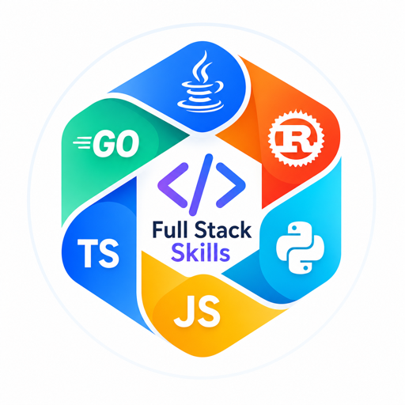

<div align="center">

# Full-Stack-Skills

</div>


<p align="center">
  
</p>

<p align="center">
  <strong>面向 AI Coding Agent 的全栈技能生态 —— 51 个目录收录技能包，覆盖前端、后端、移动端、DevOps、设计、Spec 驱动研发等全链路场景</strong>
</p>

<p align="center">
  <a href="https://github.com/full-stack-skills"></a>
  <a href="https://github.com/full-stack-skills"></a>
  <a href="https://agentskills.io"></a>
  <a href="https://github.com/full-stack-skills/.github/blob/main/LICENSE"></a>
</p>

---

<!-- ecosystem-navigation:start -->

## 生态导航

| 方向 | 适用任务 | 目录与安装 | 组织 |
| --- | --- | --- | --- |
| Full Stack Skills | 软件开发、架构设计、测试与运维 | [PartMe.AI / full-stack-skills](https://github.com/partme-ai/full-stack-skills) | [full-stack-skills](https://github.com/full-stack-skills) |
| Full AIGC Skills | 图像、视频、音频等内容创作 | [PartMe.AI / full-aigc-skills](https://github.com/partme-ai/full-aigc-skills) | [full-aigc-skills](https://github.com/full-aigc-skills) |
| Full Stack Plugins | 研发与运维的工具集成和工作流 | [PartMe.AI / full-stack-plugins](https://github.com/partme-ai/full-stack-plugins) | [full-stack-plugins](https://github.com/full-stack-plugins) |
| Full AIGC Plugins | 内容制作的工具集成和生成工作流 | [PartMe.AI / full-aigc-plugins](https://github.com/partme-ai/full-aigc-plugins) | [full-aigc-plugins](https://github.com/full-aigc-plugins) |

<!-- ecosystem-navigation:end -->

---

## 关于我们

Full-Stack-Skills 是一个开放的全栈技能生态组织，致力于为 AI 智能体（Agent）提供标准化、可复用的技能包。每项技能严格遵循 [Agent Skills 规范](https://agentskills.io/)，以 `SKILL.md` 为载体，覆盖从需求分析、设计、开发、测试到交付的全流程。

> **核心理念**：Skills 标准化封装（SKILL.md） · Skills 跨平台发现与复用 · Skills 提示工程

---

## 技能生态总览

目录收录 **51 个包 / 788 个技能条目**，核对日期 2026-10-06。按各包 GitHub `main` 的 `skills/*/SKILL.md` 统计；社区推荐与目录外的包不计入。完整分类与技能名见 [技能目录](https://github.com/partme-ai/full-stack-skills) 和 [索引](https://github.com/partme-ai/full-stack-skills/blob/main/SKILLS_INDEX.md)。

---

## 仓库导航

以下是部分仓库的用途导航；完整包清单、技能统计与安装命令以[目录仓库](https://github.com/partme-ai/full-stack-skills#技能目录)为准。

### 前端框架与 UI

| 仓库 | 技能内容 |
|------|---------|
| [vue-skills](https://github.com/full-stack-skills/vue-skills) | Vue 2/3, Pinia, Vue Router, Vuex |
| [react-skills](https://github.com/full-stack-skills/react-skills) | React, Hooks, Next.js, Redux, React Native |
| [angular-skills](https://github.com/full-stack-skills/angular-skills) | Angular 框架 |
| [svelte-skills](https://github.com/full-stack-skills/svelte-skills) | Svelte 框架 |
| [vue-ui-skills](https://github.com/full-stack-skills/vue-ui-skills) | Element Plus, Bootstrap Vue, Vant, Layui |
| [antd-skills](https://github.com/full-stack-skills/antd-skills) | Ant Design (Vue / React / Mobile / Mini) |
| [uview-skills](https://github.com/full-stack-skills/uview-skills) | uView 2.x / uView Pro (uni-app) |
| [avue-skills](https://github.com/full-stack-skills/avue-skills) | Avue CRUD / Form / Admin |
| [build-skills](https://github.com/full-stack-skills/build-skills) | Webpack, Rollup, Parcel, Rspack, Vite, Sass |
| [chart-skills](https://github.com/full-stack-skills/chart-skills) | ECharts, uCharts, Lime ECharts |
| [cocos-skills](https://github.com/full-stack-skills/cocos-skills) | Cocos2d-x 游戏引擎 |

### 服务端与跨端开发

| 仓库 | 技能内容 |
|------|---------|
| [spring-skills](https://github.com/full-stack-skills/spring-skills) | Spring Boot / Cloud / AI / Security / JPA |
| [java-skills](https://github.com/full-stack-skills/java-skills) | Java 开发最佳实践与规范 |
| [nodejs-skills](https://github.com/full-stack-skills/nodejs-skills) | Express, Fastify, NestJS, Koa |
| [python-skills](https://github.com/full-stack-skills/python-skills) | Django, FastAPI, Flask |
| [go-skills](https://github.com/full-stack-skills/go-skills) | Gin 框架 |
| [uniapp-skills](https://github.com/full-stack-skills/uniapp-skills) | uni-app / uniCloud / uni-ad |
| [flutter-skills](https://github.com/full-stack-skills/flutter-skills) | Flutter 移动端 |
| [mobile-native-skills](https://github.com/full-stack-skills/mobile-native-skills) | Android Kotlin, iOS Swift |
| [electron-skills](https://github.com/full-stack-skills/electron-skills) | Electron / Electron EGG |
| [tauri-skills](https://github.com/full-stack-skills/tauri-skills) | Tauri v2 (52 个桌面/移动技能) |
| [database-skills](https://github.com/full-stack-skills/database-skills) | PostgreSQL, Oracle, Redis, Elasticsearch |

### 工程化与架构

| 仓库 | 技能内容 |
|------|---------|
| [ddd-skills](https://github.com/full-stack-skills/ddd-skills) | DDD / COLA / 微服务 / 六边形架构 / 整洁架构 |
| [devops-skills](https://github.com/full-stack-skills/devops-skills) | GitLab CI, GitHub Actions, K8s, Terraform, Ansible |
| [docker-skills](https://github.com/full-stack-skills/docker-skills) | Docker / Docker Compose |
| [testing-skills](https://github.com/full-stack-skills/testing-skills) | Jest, Vitest, PyTest, JUnit, Cypress, Playwright |
| [nvm-skills](https://github.com/full-stack-skills/nvm-skills) | Node Version Manager 安装/配置/排错 |
| [vscode-skills](https://github.com/full-stack-skills/vscode-skills) | VS Code 扩展开发 |

### 设计、文档与视觉

| 仓库 | 技能内容 |
|------|---------|
| [design-skills](https://github.com/full-stack-skills/design-skills) | Figma, Sketch, Adobe XD, AI 艺术工具 |
| [document-skills](https://github.com/full-stack-skills/document-skills) | Mermaid, PlantUML, API 文档, ProcessOn, Full-Stack-Doc |
| [ocrmypdf-skills](https://github.com/full-stack-skills/ocrmypdf-skills) | OCRmyPDF 核心/图像/优化/批处理/API |
| [drawio-skills](https://github.com/full-stack-skills/drawio-skills) | Draw.io 架构图 / 流程图 |
| [ascii-skills](https://github.com/full-stack-skills/ascii-skills) | ASCII 艺术 / Banner / 表格 / 图表 / 动画 |
| [threejs-skills](https://github.com/full-stack-skills/threejs-skills) | Three.js 3D：场景/相机/材质/几何体/着色器 |

### Spec 驱动与设计协同

| 仓库 | 技能内容 |
|------|---------|
| [speckit-skills](https://github.com/full-stack-skills/speckit-skills) | Spec Kit —— Spec 驱动开发工作流 |
| [openspec-skills](https://github.com/full-stack-skills/openspec-skills) | OpenSpec —— SDD 工作流 |
| [stitch-skills](https://github.com/full-stack-skills/stitch-skills) | Stitch MCP —— UI 设计 / 屏幕生成 / 组件 |
| [pencil-skills](https://github.com/full-stack-skills/pencil-skills) | Pencil MCP —— 设计工具 / 系统 / UI 设计 |
| [t2ui-skills](https://github.com/full-stack-skills/t2ui-skills) | T2UI 组件技能（97 个 TUI 组件） |

### 通用支持与 AI 辅助

以下为目录外的组织包与社区参考，不计入上面的 51 个包 / 788 个技能条目。

| 仓库 | 技能内容 |
|------|---------|
| [social-skills](https://github.com/full-stack-skills/social-skills) | Slack GIF Creator |
| [teaching-skills](https://github.com/full-stack-skills/teaching-skills) | 课程设计 / 学习评估 |
| [baoyu-skills](https://github.com/JimLiu/baoyu-skills) | baoyu-skills (Fork from JimLiu) |

---

## 快速开始

```bash
# 查看技能，再按项目和宿主安装
npx skills add full-stack-skills/vue-skills --list
npx skills add full-stack-skills/vue-skills --skill vue3 --agent codex
```

安装范围、Claude Code 示例与排查步骤见 [快速开始指南](https://github.com/partme-ai/full-stack-skills/blob/main/QUICKSTART.md)。

---

## 贡献指南

欢迎贡献新技能或改进现有技能！

1. **Fork** 目标仓库
2. 按照 [Agent Skills 规范](https://agentskills.io/) 创建 `SKILL.md`
3. 提交 PR

技能结构规范：
```
skills/<skill>/
  SKILL.md      # 技能主文档（必需）
  examples/     # 使用示例（可选）
  references/   # 参考资料（可选）
  scripts/      # 自动化脚本（可选）
  assets/       # 资源文件（可选）
```

---

## 联系我们

- Email: [partmeai@gmail.com](mailto:partmeai@gmail.com)
- Location: China

---

<p align="center">
  <sub>Made with ❤️ by PartMe AI Team</sub>
</p>